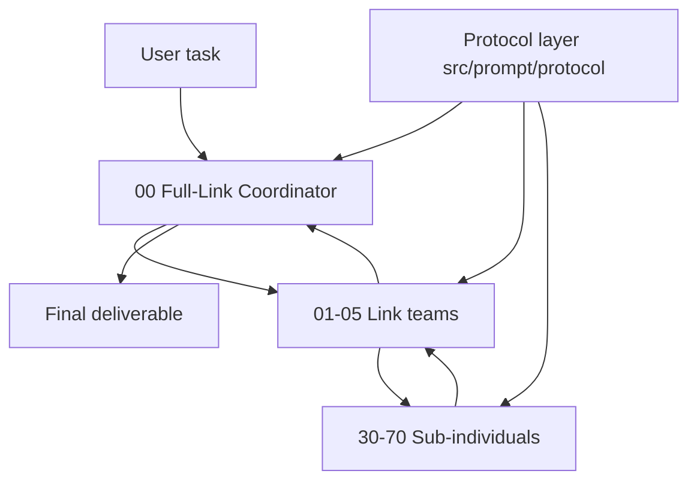

# ExMachina

> [!WARNING]
> **⚠️ This project has not been fully tested.**
> Install surfaces, generated artifacts, and multi-agent behavior may deviate in unverified scenarios.
> You must **verify the install and runtime behavior yourself** and use it **cautiously in controlled environments**.
> Do not deploy it to production or high-risk tasks without your own validation.
> Please open an issue if you hit problems.

```text
███████╗██╗  ██╗███╗   ███╗ █████╗  ██████╗██╗  ██╗██╗███╗   ██╗ █████╗
██╔════╝╚██╗██╔╝████╗ ████║██╔══██╗██╔════╝██║  ██║██║████╗  ██║██╔══██╗
█████╗   ╚███╔╝ ██╔████╔██║███████║██║     ███████║██║██╔██╗ ██║███████║
██╔══╝   ██╔██╗ ██║╚██╔╝██║██╔══██║██║     ██╔══██║██║██║╚██╗██║██╔══██║
███████╗██╔╝ ██╗██║ ╚═╝ ██║██║  ██║╚██████╗██║  ██║██║██║ ╚████║██║  ██║
╚══════╝╚═╝  ╚═╝╚═╝     ╚═╝╚═╝  ╚═╝ ╚═════╝╚═╝  ╚═╝╚═╝╚═╝  ╚═══╝╚═╝  ╚═╝
```

**ExMachina** is a mechanical-intelligence operating layer for general AI software. It does not optimize for persona, chat style, or human-like conversation. It optimizes for explicit evidence, bounded execution, visible conflict handling, auditable routing, and stable decomposition, implementation, verification, and closure for complex tasks.

Supported platforms: **Codex · Claude Code · Cursor · OpenCode · Gemini CLI · Trae · Kiro · VS Code · OpenClaw · Hermes Agent**

---

## Table of Contents

- [What This System Solves](#what-this-system-solves)
- [Positioning](#positioning)
- [Core Ideas](#core-ideas)
- [Role System](#role-system)
- [Protocol Layer](#protocol-layer)
- [Repository Layout](#repository-layout)
- [Installation](#installation)
- [Configuration](#configuration)
- [Usage Examples](#usage-examples)
- [Source Layer vs Artifact Layer](#source-layer-vs-artifact-layer)
- [Implementation Status](#implementation-status)

## What This System Solves

Typical prompt packs fail in three ways:

- **Blurry role boundaries**: analysis, execution, and verification collapse into one stream and produce answers that sound complete but are hard to validate.
- **Prompt drift**: the same behavior logic spreads across platforms and install surfaces, so one change turns into many manual edits.
- **Fake multi-agent**: piles of personas without a stable division of labor, return-flow contract, or arbitration protocol.

ExMachina hardens those points by:

- defining role boundaries through a layered structure
- defining collaboration through protocols instead of improvisation
- generating multi-platform surfaces from a single source of truth
- enforcing uncertainty retention, evidence grading, counter-evidence, and conflict resolution across the whole operating loop

## Positioning

ExMachina is not a single system prompt, and not a package for one client only. It is closer to an operating layer in between:

- For tools with native multi-agent support, ExMachina ships the full multi-agent structure and distribution artifacts.
- For tools without multi-agent support, ExMachina simulates partial units and chains through Skills, commands, rules, or instruction files.
- For the same behavior logic, ExMachina maintains one source and distributes it to different install surfaces.

## Core Ideas

### 1. Mechanical intelligence

"Mechanical" here is not about cold tone or machine-like writing. It is a stricter way of working:

- never disguise guesses as conclusions
- never disguise local observations as global facts
- never disguise a single success as a stable capability
- never disguise fluent language as correct reasoning

### 2. Layered structure



- **Top**: the `Full-Link Coordinator` — global routing, arbitration, and closure.
- **Middle**: per-domain `Link teams` — scheduling sub-individuals, constraining output shape, controlling return flow.
- **Bottom**: `Sub-individuals` — stable, composable, replaceable functional units.

A `Link team` is a **team concept**, not a single agent: the team leader plus the sub-individuals mounted for the current task. The same sub-individual can be reused by multiple teams.

### 3. Teams for big tasks, direct calls for small ones

- Complex tasks flow through `Full-Link Coordinator -> Link team -> Sub-individual`.
- Medium tasks go straight to a Link team.
- Small tasks can temporarily load a single sub-individual capability without assembling a full team.

## Role System

Role sources live in `src/prompt/agents/`. The actual composition:

| Layer | Numbering | Count | Units |
|-------|-----------|------:|-------|
| Top coordinator | `00_` | 1 | `00_全连结指挥体` (absorbed the former coordination role: task decomposition, progress and resource management) |
| Link teams | `01_` ~ `05_` | 5 | `01_研究与理性` (research & rationality), `02_架构与实作` (architecture & implementation), `03_校验与安全` (validation & security), `04_集成与运维` (integration & operations), `05_文档与体验` (documentation & experience) |
| Sub-individuals | `30_` ~ `70_` | 12 | `30_上下文体` (context), `32_比对假设体` (comparison & hypotheses), `34_接驳配置体` (integration & config), `36_发布运维体` (release & ops), `44_汇报体` (reporting), `45_证据裁决体` (evidence & arbitration), `46_验证体` (verification), `47_文档体` (docs), `48_安全体` (security), `49_架构规划体` (architecture & planning), `69_编码体` (coding), `70_审核体` (review) |

The role system was consolidated in one round: the original 1 + 11 link teams + 21 sub-individuals were reduced to 1 + 5 + 12. All functions of the merged roles are inherited by their successors (see the function map in [`src/prompt/agents/README_组合指南.md`](src/prompt/agents/README_组合指南.md)).

> Note: numbering is kept for stable indexing and distribution consistency; the non-contiguous numbers (30/32/34/36/44/45/46/47/48/49/69/70) are historical indexes preserved after the consolidation.

## Protocol Layer

Protocol sources live in `src/prompt/protocol/` and apply to every role — 12 documents in total:

| Protocol | Focus |
|----------|-------|
| `01_绝对理性协议` | language discipline, execution stance |
| `02_证据分级协议` | evidence grades A/B/C/D matched to conclusion strength |
| `03_冲突裁决协议` | arbitration when conclusions conflict |
| `04_工作区与协作协议` | workspace resources and collaboration boundaries |
| `05_多智能体回流协议` | how intermediate results flow back between layers |
| `06_输出契约` | minimum fields of the final output |
| `06_代码审查协议` | execution standard for review tasks |
| `07_调试协议` | execution standard for debugging tasks |
| `08_变更协议` | change scope and reversibility control |
| `09_安全审计协议` | execution standard for security reviews |
| `10_发布协议` | pre-release checks and closure |
| `11_回滚协议` | rollback paths and recovery discipline |

> Note: the `06_` number is shared by `输出契约` and `代码审查协议`, distinguished by full file name.

Roles tell the model what to do; protocols tell the model what counts as compliant.

## Repository Layout

```text
.
├─ agents/                # shared role prompts (generated)
├─ benchmark/             # benchmark scenarios
├─ commands/              # command entry docs (generated)
├─ dist/                  # per-platform artifacts
│  ├─ codex/              # Codex docs and skill surfaces
│  ├─ claude-plugin/      # repo-level Claude plugin entry
│  ├─ cursor/             # repo-level Cursor rules fallback
│  ├─ cursor-plugin/      # repo-level Cursor plugin entry
│  ├─ gemini/             # Gemini helper files
│  ├─ hermes/             # Hermes Agent surface (install docs + config snippet + skill copies)
│  ├─ opencode/           # repo-level OpenCode plugin entry
│  ├─ kiro/               # Kiro skills and steering
│  ├─ openclaw/           # OpenClaw pack
│  ├─ trae/               # Trae rules, skills, custom agents
│  ├─ vscode/             # VS Code-style prompt / instructions
│  └─ old/                # historical archive
├─ evals/                 # eval helpers and trigger samples
├─ examples/              # example task briefs
├─ hooks/                 # shared hooks
├─ paper/                 # long-form docs
├─ skills/                # shared skill surfaces
├─ src/                   # single source layer (the only place edited by hand)
│  ├─ build.ts            # dispatcher (orchestration)
│  ├─ build/              # dispatcher modules (lib / content / prompts / platforms / openclaw)
│  ├─ exmachina/          # plugin.json source
│  ├─ prompt/             # agents / protocol / AGENTS.md / RULES.md
│  └─ templates/          # cross-surface templates (zh-CN / en-US)
├─ scripts/               # install scripts (setup-exmachina.sh / .ps1) and dev tools
├─ gemini-extension.json  # repo-level Gemini extension manifest
└─ README.md
```

## Installation

### Generic install (Codex route)

```bash
git clone https://github.com/KurohaneKaoruko/Ex-Machina ~/exmachina
cd ~/exmachina
bash ./scripts/setup-exmachina.sh
```

Windows PowerShell:

```powershell
git clone https://github.com/KurohaneKaoruko/Ex-Machina "$HOME/exmachina"
Set-Location "$HOME/exmachina"
.\scripts\setup-exmachina.ps1
```

Lifecycle modes:

```bash
bash ./scripts/setup-exmachina.sh --verify           # check install status
bash ./scripts/setup-exmachina.sh --uninstall        # remove managed content
bash ./scripts/setup-exmachina.sh --install-guidance --guidance-language en
```

### Per-platform install

| Platform | Location | Reference doc |
|----------|----------|---------------|
| OpenAI Codex | `scripts/` + `skills/` + `agents/` + `dist/codex/` | [`dist/codex/INSTALL.en.md`](dist/codex/INSTALL.en.md) |
| Claude Code | `dist/claude-plugin/` | [`dist/claude-plugin/INSTALL.en.md`](dist/claude-plugin/INSTALL.en.md) |
| Cursor | `dist/cursor-plugin/` + `dist/cursor/` | [`dist/cursor-plugin/INSTALL.en.md`](dist/cursor-plugin/INSTALL.en.md) |
| OpenCode | `dist/opencode/` | [`dist/opencode/INSTALL.en.md`](dist/opencode/INSTALL.en.md) |
| Gemini CLI | `gemini-extension.json` + `dist/GEMINI.md` + `dist/gemini/` | [`dist/gemini/INSTALL.en.md`](dist/gemini/INSTALL.en.md) |
| **Hermes Agent** | `dist/hermes/` (or the root `skills/` directly) | [`dist/hermes/INSTALL.en.md`](dist/hermes/INSTALL.en.md) |
| OpenClaw | `dist/openclaw/` | [`dist/openclaw/INSTALL.en.md`](dist/openclaw/INSTALL.en.md) |
| Trae | `dist/trae/` | [`dist/trae/INSTALL.en.md`](dist/trae/INSTALL.en.md) |
| Kiro | `dist/kiro/` | artifacts generated; follow the directory layout |
| VS Code | `dist/vscode/` | prompt / instructions artifacts generated |

### Hermes Agent quick start

Hermes Agent (Nous Research) uses a "directory + `SKILL.md`" skill library, directly compatible with the root `skills/`. Pick one:

**Option A — external_dirs (recommended)**: add to `~/.hermes/config.yaml` (see [`dist/hermes/config-snippet.yaml`](dist/hermes/config-snippet.yaml)):

```yaml
skills:
  external_dirs:
    - ~/exmachina/skills
```

**Option B — copy install**:

```bash
mkdir -p ~/.hermes/skills
cp -r ~/exmachina/skills/exmachina-zh ~/exmachina/skills/exmachina-en \
      ~/exmachina/skills/using-exmachina ~/exmachina/skills/using-exmachina-zh \
      ~/exmachina/skills/using-exmachina-en ~/.hermes/skills/
```

Verify:

```bash
hermes skills list   # should list exmachina-zh
```

Full instructions (SOUL.md managed block, uninstall, troubleshooting) in [`dist/hermes/INSTALL.en.md`](dist/hermes/INSTALL.en.md).

### Contributor build

```bash
npm install
npm run generate   # tsc compile + node build/build.js
npm run verify     # artifact integrity + installer smoke test
```

## Configuration

### User side

| Setting | Purpose | Platform |
|---------|---------|----------|
| `EXMACHINA_LANG` / `EXMACHINA_LANGUAGE` | force bootstrap skill language (`zh` / `en`), overriding locale detection | OpenCode plugin |
| `LANG` / `LC_ALL` | language fallback when not forced | OpenCode plugin |
| `skills.external_dirs` | register the repo `skills/` into the Hermes skill library | Hermes Agent |
| Cursor Rules | install `dist/cursor/rules/exmachina.mdc` (zh) or `exmachina-en.mdc` (en), `alwaysApply: true` | Cursor |
| `GEMINI.md` context | `gemini-extension.json` points `contextFileName` at `GEMINI.md`, which `@`-includes the bootstrap skill | Gemini CLI |
| OpenClaw settings | `dist/openclaw/openclaw.settings.json` (full) and `openclaw.settings.lite.json` (lite) with merge instructions | OpenClaw |

### Contributor side (build environment variables)

| Variable | Purpose | Default |
|----------|---------|---------|
| `EXMACHINA_REPOSITORY_URL` | repository URL rendered into artifacts (SSH form auto-converted) | `https://github.com/KurohaneKaoruko/Ex-Machina` |
| `EXMACHINA_BRANCH` | branch used for raw links | `main` |
| `EXMACHINA_RAW_BASE_URL` | raw base URL override, skipping derivation | derived from the two above |

### Language convention

Chinese surfaces are the default entry; English surfaces are provided via `*.en.md` / `-en` skills. Bilingual priority: skill entries, command entries, per-platform install docs, READMEs. Internal agents / protocols may stay single-language.

## Usage Examples

### Command entry

```text
/ex Track this regression, evidence before code.
```

### Skill trigger (no command needed)

Tasks that naturally trigger ExMachina behavior:

```text
Analyze this error and fix it.
Do a code review; list risks before summarizing.
The requirements are unclear — lock the acceptance criteria first, then assess risk.
```

Prompts that do **not** trigger (normal conversation):

```text
Simple greetings.
Translating a sentence.
Summarizing text already provided.
```

(Trigger samples in `evals/trigger-prompts/`.)

### Expected behavior difference

For the same fix task:

- **Without ExMachina**: the model guesses a cause and proposes a change.
- **With ExMachina**: the model locks the task boundary → lists evidence and gaps → separates fact/inference/hypothesis → proposes a minimal reversible fix with a rollback path → states residual unknowns.

### Multi-agent cooperation (OpenClaw route)

In OpenClaw full mode, the `exmachina-main` coordinator splits complex tasks across link-team sub-agents; results flow back with `[role]:` markers and evidence grades, and the coordinator arbitrates and closes. See [`dist/openclaw/INSTALL.en.md`](dist/openclaw/INSTALL.en.md).

### Example task brief

`examples/task-brief.json` shows the standard task input format (goal, acceptance criteria, constraints, excluded scope) — usable directly as a prompt template.

## Source Layer vs Artifact Layer

`src/` is the single source layer; the repository root is the generated shared-content layer and platform adaptation layer.

| Path | Responsibility |
|------|----------------|
| `src/prompt/agents/` | coordinator, link team, and sub-individual prompts |
| `src/prompt/protocol/` | all shared protocols |
| `src/prompt/AGENTS.md` | the full operating protocol (generates root `AGENTS.md` and `dist/codex/AGENTS.md`) |
| `src/prompt/RULES.md` | rules source (generates Cursor / Kiro rule artifacts) |
| `src/templates/{zh-CN,en-US}/` | per-platform install docs, skills, command templates |
| `src/build.ts` + `src/build/` | the single dispatcher (orchestration + lib/content/prompts/platforms/openclaw modules) |
| `src/exmachina/plugin.json` | repo-level entry metadata source |

Hand-edits to generated artifacts will be overwritten on the next build.

## Implementation Status

Available today:

- Skill and multi-platform distribution surfaces (including the Hermes Agent surface)
- Codex native install surface with a lifecycle-managed installer script
- Repo-level install entries for Cursor / Claude / OpenCode / Gemini / OpenClaw
- Bilingual (zh/en) user-facing surfaces
- Pyramid role sources and protocol sources
- `src/` single source of truth with a modular dispatcher
- `/ex`, `/excodex`, `/exclaude` command entries
- Basic `benchmark` and `evals` skeletons
- `npm run verify` artifact integrity checks and installer smoke tests

Known limitations and ongoing work:

- **The project has not been fully tested** (see the warning at the top)
- Stronger runtime routing
- A complete automated evaluation loop
- The OpenClaw install doc references `scripts/apply-openclaw-settings.mjs`, which is not shipped yet; OpenClaw integration currently requires manual steps per the doc
- More stable scenario benchmarks and regression mechanisms

## License

MIT
