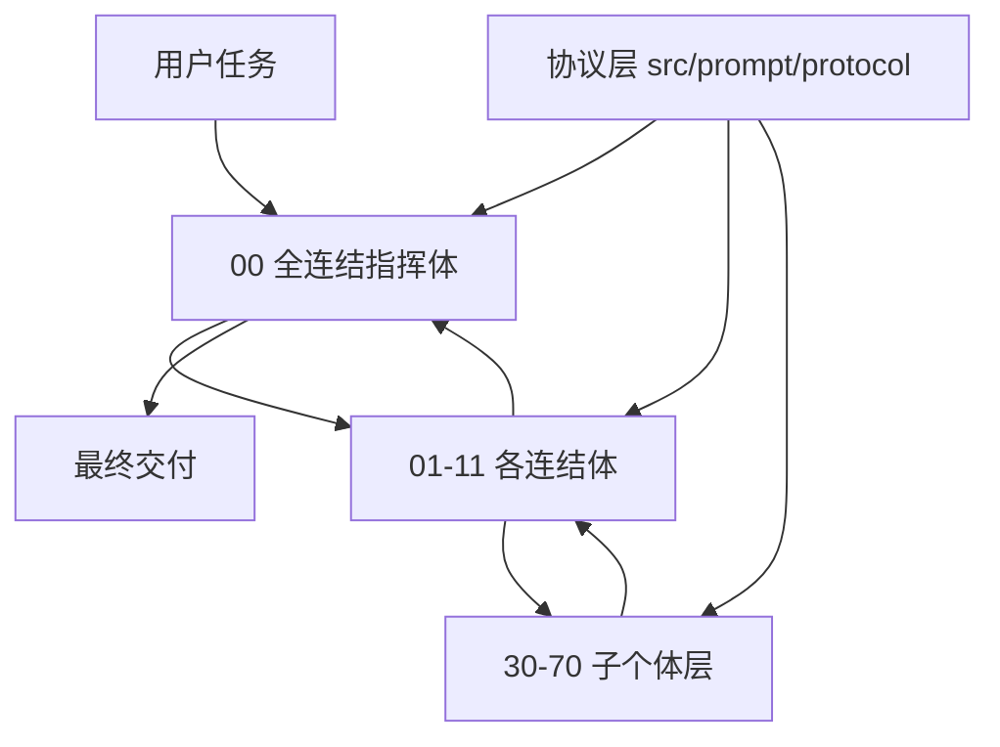

# ExMachina

> [!WARNING]
> **⚠️ 本项目尚未经过全面的功能测试。**
> 各平台安装面、构建产物与多智能体行为均可能在未验证的场景下出现偏差。
> 使用者需**自行验证**安装结果与运行行为，并在受控环境中**谨慎使用**；
> 请勿在未经验证的情况下将其直接用于生产或高风险任务。
> 发现问题请提交 Issue 反馈。

```text
███████╗██╗  ██╗███╗   ███╗ █████╗  ██████╗██╗  ██╗██╗███╗   ██╗ █████╗
██╔════╝╚██╗██╔╝████╗ ████║██╔══██╗██╔════╝██║  ██║██║████╗  ██║██╔══██╗
█████╗   ╚███╔╝ ██╔████╔██║███████║██║     ███████║██║██╔██╗ ██║███████║
██╔══╝   ██╔██╗ ██║╚██╔╝██║██╔══██║██║     ██╔══██║██║██║╚██╗██║██╔══██║
███████╗██╔╝ ██╗██║ ╚═╝ ██║██║  ██║╚██████╗██║  ██║██║██║ ╚████║██║  ██║
╚══════╝╚═╝  ╚═╝╚═╝     ╚═╝╚═╝  ╚═╝ ╚═════╝╚═╝  ╚═╝╚═╝╚═╝  ╚═══╝╚═╝  ╚═╝
```

**ExMachina** 是一套面向通用 AI 软件的机械智能操作层。它不追求人格化、不追求"像人类一样聊天"，而是追求绝对理性、证据驱动、冲突显式化、路径可审计，以及在复杂任务中稳定地拆解、执行、校验和收束。

支持平台：**Codex · Claude Code · Cursor · OpenCode · Gemini CLI · Trae · Kiro · VS Code · OpenClaw · Hermes Agent**

---

## 目录

- [这套系统解决什么问题](#这套系统解决什么问题)
- [系统定位](#系统定位)
- [核心理念](#核心理念)
- [角色体系](#角色体系)
- [协议层](#协议层)
- [仓库结构](#仓库结构)
- [安装指南](#安装指南)
- [配置说明](#配置说明)
- [使用示例](#使用示例)
- [源码层与产物层](#源码层与产物层)
- [当前实现状态](#当前实现状态)
- [设计原则总结](#设计原则总结)

## 这套系统解决什么问题

普通提示词系统常见的问题有三类：

- **角色边界模糊**：分析、执行、校验混在一起，模型容易边想边编，最后输出看似完整但无法验证。
- **提示词重复分叉**：同一段逻辑散落在多个平台、多种安装面里，后续一改就漂移。
- **多智能体协作失真**：表面上有"很多智能体"，本质上只是堆很多身份，没有稳定的分工协议、回流协议和冲突裁决机制。

ExMachina 的目标就是把这三件事做硬：

- 用多层结构定义角色边界。
- 用协议定义协作方式，而不是让角色自由发挥。
- 用单一真相源生成多平台产物，避免多处手改。
- 用"未知保留、证据分级、反证优先、冲突裁决"约束整个系统。

## 系统定位

ExMachina 不是单一模型的一段系统提示词，也不是只服务某一个客户端的软件包。它更接近一层中间操作层：

- 对支持多智能体协作的软件，ExMachina 提供完整的多智能体结构与分发产物。
- 对不支持多智能体的软件，ExMachina 通过 Skill、命令、规则或指令文件模拟局部子个体或局部链路。
- 对同一套行为逻辑，ExMachina 只维护一套源，再复制分发到不同安装面。

## 核心理念

### 1. 机械智能

这里的"机械智能"不是冷酷语气，也不是故意写得像机器，而是指一套更严格的工作方式：

- 不把猜测伪装成结论。
- 不把局部观察伪装成全局事实。
- 不把单次成功伪装成稳定能力。
- 不把语言流畅伪装成推理正确。

ExMachina 要求模型优先做这些事：明确任务边界、识别未知与缺口、区分事实/推断/假设/风险、输出可校验的下一步、在冲突信息出现时显式裁决。

### 2. 多层结构



- **顶层**：`全连结指挥体`，负责总路由、总裁决、总收束。
- **中层**：各工作域 `连结体`，负责域内调度子个体、约束输出形态、控制回流节奏。
- **底层**：`子个体`，稳定、可组合、可替换的功能单元。

最容易混淆的一点：

- `连结体` 是**团队概念**，不是单个智能体，由 `连结指挥体 + 按任务动态挂载的子个体集合` 组成。
- 同一个子个体可以按职能被多个连结体复用，不存在强制的一对一归属。

### 3. 大任务组队，小任务直达

- 复杂任务由 `全连结指挥体 -> 某连结体 -> 子个体` 逐层分派。
- 中等任务可以直接交给某个连结体完成。
- 小任务可以直接临时加载某个子个体能力，而不需要完整组建连结体。

这让系统既能处理复杂任务，也能在不支持原生多智能体的软件里通过 Skill 模拟局部能力。

## 角色体系

角色源位于 `src/prompt/agents/`，当前实际构成：

| 层级 | 编号区间 | 数量 | 示例 |
|------|----------|-----:|------|
| 顶层指挥体 | `00_` | 1 | `00_全连结指挥体` |
| 工作域连结体 | `01_` ~ `11_` | 11 | `02_研究连结体`、`04_实作连结体`、`05_校验连结体`、`10_安全连结体` |
| 子个体 | `30_` ~ `70_` | 21 | `30_上下文体`、`45_证据体`、`65_侦察体`、`69_编码体`、`70_审核体` |

> 说明：`agents/` 目录曾经历一轮命名收敛，个别编号（如 `37_`、`40_`）被两个子个体复用，按完整文件名区分。编号用于维持稳定索引与分发一致性。

子个体的定位不是"独立人格"，而是按职责复用的功能单元，可以同时出现在多个连结体的常用挂载清单中。

## 协议层

协议源位于 `src/prompt/protocol/`，对所有角色生效，当前共 12 份：

| 协议 | 约束重点 |
|------|----------|
| `01_绝对理性协议` | 语言纪律、执行姿态 |
| `02_证据分级协议` | 证据等级 A/B/C/D 与结论强度匹配 |
| `03_冲突裁决协议` | 多个结论冲突时的裁决流程 |
| `04_工作区与协作协议` | 工作区资源与协作边界 |
| `05_多智能体回流协议` | 中间结果如何在层级间回流 |
| `06_输出契约` | 最终输出的最小字段 |
| `06_代码审查协议` | 审查类任务的执行规范 |
| `07_调试协议` | 调试类任务的执行规范 |
| `08_变更协议` | 变更范围与可逆性控制 |
| `09_安全审计协议` | 安全审查的执行规范 |
| `10_发布协议` | 发布前检查与收束 |
| `11_回滚协议` | 回退路径与恢复纪律 |

> 说明：`06_` 编号被 `输出契约` 与 `代码审查协议` 复用，按完整文件名区分。

可以把它理解成：角色告诉模型"做什么"，协议告诉模型"怎么做才算合规"。

## 仓库结构

当前仓库采用"根目录共享内容 + 根目录平台适配层 + `src/` 单一源码层"结构：

```text
.
├─ agents/                # 共享角色提示词（生成）
├─ benchmark/             # 基准场景
├─ commands/              # 命令入口文档（生成）
├─ dist/                  # 各平台产物集中目录
│  ├─ codex/              # Codex 文档与技能使用面
│  ├─ claude-plugin/      # 仓库级 Claude 插件入口
│  ├─ cursor/             # 仓库级 Cursor 规则回退面
│  ├─ cursor-plugin/      # 仓库级 Cursor 插件入口
│  ├─ gemini/             # Gemini 辅助文件
│  ├─ hermes/             # Hermes Agent 安装面（安装文档 + 配置片段 + 技能副本）
│  ├─ opencode/           # 仓库级 OpenCode 插件入口
│  ├─ kiro/               # Kiro 技能与 steering 面
│  ├─ openclaw/           # OpenClaw 包
│  ├─ trae/               # Trae 规则、技能与自定义 agents
│  ├─ vscode/             # VS Code 风格 prompt / instructions 面
│  └─ old/                # 历史归档
├─ evals/                 # 评测辅助与触发样本
├─ examples/              # 示例任务包
├─ hooks/                 # 共享 hooks
├─ paper/                 # 长文档说明
├─ skills/                # 共享技能面
├─ src/                   # 单一源码层（唯一需要手工编辑的目录）
│  ├─ build.ts            # 分发器（编排）
│  ├─ build/              # 分发器模块（lib / content / prompts / platforms / openclaw）
│  ├─ exmachina/          # plugin.json 源
│  ├─ prompt/             # agents / protocol / AGENTS.md / RULES.md
│  └─ templates/          # 跨安装面模板（zh-CN / en-US）
├─ scripts/               # 安装脚本（setup-exmachina.sh / .ps1）与 dev 工具
├─ gemini-extension.json  # 仓库级 Gemini extension manifest
└─ README.md
```

## 安装指南

### 通用安装（Codex 路线）

```bash
git clone https://github.com/KurohaneKaoruko/Ex-Machina ~/exmachina
cd ~/exmachina
bash ./scripts/setup-exmachina.sh
```

Windows PowerShell：

```powershell
git clone https://github.com/KurohaneKaoruko/Ex-Machina "$HOME/exmachina"
Set-Location "$HOME/exmachina"
.\scripts\setup-exmachina.ps1
```

安装脚本支持生命周期管理：

```bash
bash ./scripts/setup-exmachina.sh --verify           # 检查安装状态
bash ./scripts/setup-exmachina.sh --uninstall        # 卸载受管理内容
bash ./scripts/setup-exmachina.sh --install-guidance --guidance-language en  # 追加英文常驻指引
```

### 平台安装

根据你使用的 IDE 或工具，选择对应的安装方式：

| 平台 | 安装文件位置 | 参考文档 |
|------|-------------|---------|
| OpenAI Codex | `scripts/` + `skills/` + `agents/` + `dist/codex/` | [`dist/codex/INSTALL.md`](dist/codex/INSTALL.md) |
| Claude Code | `dist/claude-plugin/` | [`dist/claude-plugin/INSTALL.md`](dist/claude-plugin/INSTALL.md) |
| Cursor | `dist/cursor-plugin/` + `dist/cursor/` | [`dist/cursor-plugin/INSTALL.md`](dist/cursor-plugin/INSTALL.md) |
| OpenCode | `dist/opencode/` | [`dist/opencode/INSTALL.md`](dist/opencode/INSTALL.md) |
| Gemini CLI | `gemini-extension.json` + `dist/GEMINI.md` + `dist/gemini/` | [`dist/gemini/INSTALL.md`](dist/gemini/INSTALL.md) |
| **Hermes Agent** | `dist/hermes/`（或直接使用根目录 `skills/`） | [`dist/hermes/INSTALL.md`](dist/hermes/INSTALL.md) |
| OpenClaw | `dist/openclaw/` | [`dist/openclaw/INSTALL.md`](dist/openclaw/INSTALL.md) |
| Trae | `dist/trae/` | [`dist/trae/INSTALL.md`](dist/trae/INSTALL.md) |
| Kiro | `dist/kiro/` | 产物已生成，按目录说明接入 |
| VS Code | `dist/vscode/` | Prompt 与 instructions 产物已生成 |

各文档均有英文版（`*.en.md`）。

### Hermes Agent 快速接入

Hermes Agent（Nous Research）的技能库使用「目录 + `SKILL.md`」格式，与根目录 `skills/` 直接兼容。二选一：

**方式 A — external_dirs（推荐，更新方便）**：在 `~/.hermes/config.yaml` 中加入（参考 [`dist/hermes/config-snippet.yaml`](dist/hermes/config-snippet.yaml)）：

```yaml
skills:
  external_dirs:
    - ~/exmachina/skills
```

**方式 B — 复制安装**：

```bash
mkdir -p ~/.hermes/skills
cp -r ~/exmachina/skills/exmachina-zh ~/exmachina/skills/exmachina-en \
      ~/exmachina/skills/using-exmachina ~/exmachina/skills/using-exmachina-zh \
      ~/exmachina/skills/using-exmachina-en ~/.hermes/skills/
```

验证：

```bash
hermes skills list   # 确认输出包含 exmachina-zh
```

完整说明（含 SOUL.md 受管理块注入、卸载与故障排查）见 [`dist/hermes/INSTALL.md`](dist/hermes/INSTALL.md)。

### 贡献者构建产物

如果你在修改 `src/` 下的源码，需要重新生成全部产物：

```bash
npm install
npm run generate   # = tsc 编译 + node build/build.js
npm run verify     # 产物完整性 + 安装脚本冒烟测试
```

### 验证安装

普通使用者验证 Codex 安装：

```bash
ls ~/.codex/skills/exmachina
```

贡献者验证最新生成产物：

```bash
npm run verify
```

## 配置说明

### 使用者侧

| 配置项 | 作用 | 生效平台 |
|--------|------|----------|
| `EXMACHINA_LANG` / `EXMACHINA_LANGUAGE` | 强制引导技能语言（`zh` / `en`），覆盖系统 locale 自动判断 | OpenCode 插件 |
| `LANG` / `LC_ALL` | 未显式指定时的语言回退依据 | OpenCode 插件 |
| `skills.external_dirs` | 把仓库 `skills/` 注册进 Hermes 技能库 | Hermes Agent |
| Cursor Rules | 安装 `dist/cursor/rules/exmachina.mdc`（中文）或 `exmachina-en.mdc`（英文），`alwaysApply: true` | Cursor |
| `GEMINI.md` context | 通过 `gemini-extension.json` 的 `contextFileName` 指向 `GEMINI.md`，其中 `@` 引用引导技能 | Gemini CLI |
| OpenClaw settings | `dist/openclaw/openclaw.settings.json`（full）与 `openclaw.settings.lite.json`（lite），含合并指令与回滚说明 | OpenClaw |

### 贡献者侧（构建环境变量）

| 变量 | 作用 | 默认值 |
|------|------|--------|
| `EXMACHINA_REPOSITORY_URL` | 生成产物中的仓库地址（支持 SSH 形式自动转换） | `https://github.com/KurohaneKaoruko/Ex-Machina` |
| `EXMACHINA_BRANCH` | 生成 raw 链接所用的分支 | `main` |
| `EXMACHINA_RAW_BASE_URL` | 直接指定 raw 链接基址，跳过推导 | 由上两项推导 |

### 语言选择约定

- 中文面为默认入口；英文面通过 `*.en.md` / `-en` 技能提供。
- 优先双语的部分：Skill 入口、命令入口、各平台安装文档、README。
- 底层 agents / protocol 允许单语维护，不强制双语镜像。

## 使用示例

### 命令入口

安装后在支持命令的平台直接调用：

```text
/ex 追踪这个回归问题，先找证据再动代码。
```

### Skill 触发（无需命令）

以下任务会自然触发 ExMachina 行为模式：

```text
请帮我分析这个报错并修复它。
做一次代码审查，先列风险再总结。
这个需求边界不清，帮我把验收标准先锁住，再评估风险。
```

以下场景**不会**触发（正常对话）：

```text
简单问候。
翻译这一句话。
总结这段我已经给出的文本。
```

（触发样本见 `evals/trigger-prompts/`。）

### 期望的行为差异

安装 ExMachina 后，对同一个修复任务：

- **未安装**：模型直接猜测原因并给出改动。
- **安装后**：模型先锁定任务边界 → 列出证据与缺口 → 区分事实/推断/假设 → 给出最小可逆修复与回退路径 → 明确残余未知。

### 多智能体协作（OpenClaw 路线）

在 OpenClaw 的 full 模式下，`exmachina-main` 主控体会把复杂任务按连结体拆分派发给子代理，回流内容带 `[角色]:` 标记与证据分级，最终由主控体裁决收束。接入方式见 [`dist/openclaw/INSTALL.md`](dist/openclaw/INSTALL.md)。

### 示例任务包

`examples/task-brief.json` 给出了标准的任务输入格式（目标、验收标准、约束、排除范围），可直接作为向 ExMachina 提任务的模板。

## 源码层与产物层

`src/` 是唯一源码层，负责维护真正需要人工编辑的内容；根目录则是生成后的共享内容层与平台适配层。

| 路径 | 职责 |
|------|------|
| `src/prompt/agents/` | 全连结指挥体、各连结体、子个体提示词 |
| `src/prompt/protocol/` | 所有共享协议 |
| `src/prompt/AGENTS.md` | 主协定全文（生成根目录 `AGENTS.md` 与 `dist/codex/AGENTS.md`） |
| `src/prompt/RULES.md` | 规则面源（生成 Cursor / Kiro 规则产物） |
| `src/templates/{zh-CN,en-US}/` | 各平台安装文档、技能、命令模板 |
| `src/build.ts` + `src/build/` | 唯一分发器（编排 + lib/content/prompts/platforms/openclaw 五个模块） |
| `src/exmachina/plugin.json` | 仓库级入口元数据源 |

分发器职责：把单一源复制/渲染到不同产品目录，避免多处手改。手工修改生成产物会在下次构建时被覆盖。

## 当前实现状态

已具备的能力：

- Skill 与多平台分发表面（含 Hermes Agent 安装面）
- Codex 原生安装面与可执行安装脚本（含生命周期管理）
- Cursor / Claude / OpenCode / Gemini / OpenClaw 的仓库级安装入口
- 中英文双版本的用户交互面
- 金字塔角色源与协议源
- `src/` 单一真相源与模块化分发器
- `/ex`、`/excodex`、`/exclaude` 命令入口
- `benchmark` 与 `evals` 的基础骨架
- `npm run verify` 产物完整性校验与安装脚本冒烟测试

已知限制与持续完善方向：

- **整个项目尚未经过全面的功能测试**（再次提醒，见顶部告警）
- 更强的运行时路由能力
- 更完整的自动评测回路
- OpenClaw 安装文档引用的 `scripts/apply-openclaw-settings.mjs` 尚未随仓库提供，OpenClaw 接入暂需按文档手动操作
- 更稳定的场景基准与回归机制

## 设计原则总结

- 用多层结构组织多智能体
- 用协议而不是人格来约束行为
- 用证据与裁决替代"自信输出"
- 用单一真相源生成多平台产物
- 用机械化、可审计、可回流的方式执行复杂任务

## License

MIT
