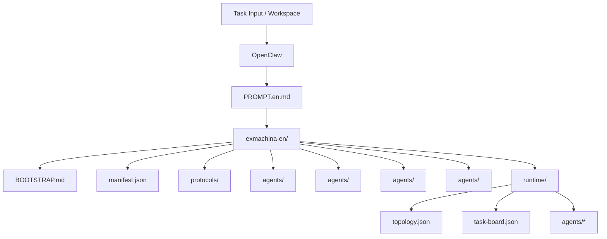
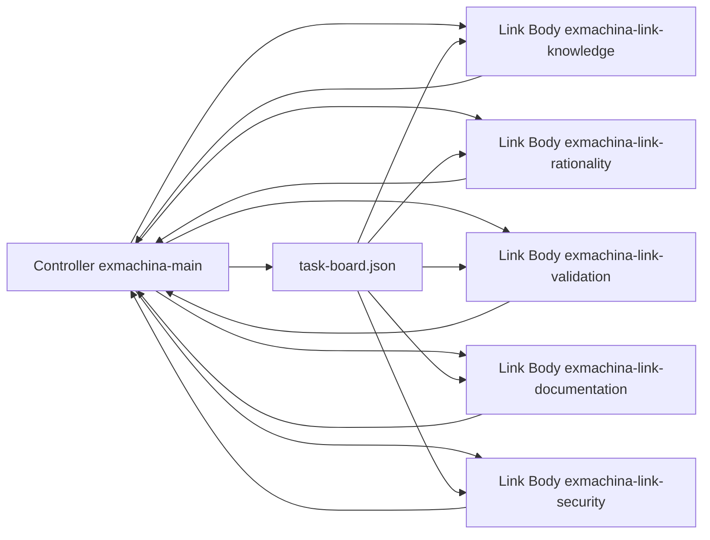

# ExMachina Architecture

## Core Structure

## Runtime Collaboration Diagram (lite / full)

Note: lite mode uses the same link-body topology but does not create subagent agents in OpenClaw. Full mode additionally creates subagent agents. The controller defaults to one active link body and may enable peers in parallel with clear division of labor.

## Maintenance Principles

- `exmachina-en/` is the single source of truth for prompts and runtime.
- `PROMPT.en.md` must stay consistent with `exmachina-en/` content.
- Topology, task board, and agent status in `runtime/` must remain consistent.
- Multi-agent reporting must use the `[xx-body]:xxx` format.
- Both lite and full modes are supported. Lite does not create subagent agents in OpenClaw; full creates all subagent agents.

