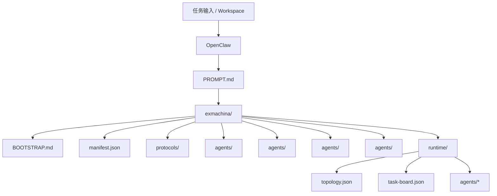
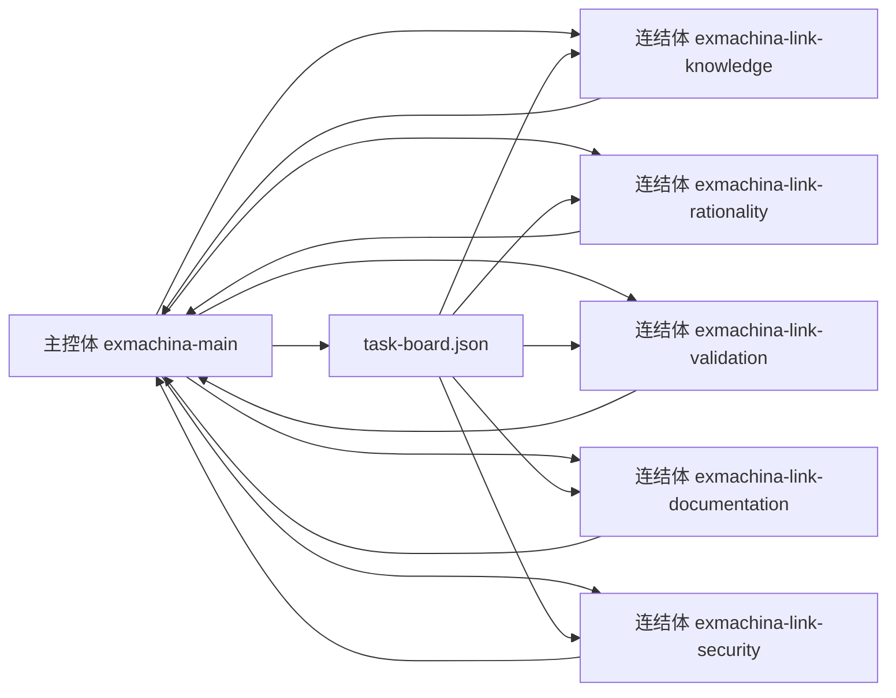

# ExMachina Architecture

## 核心结构

## 运行时协作图（lite / full 共用）

说明：lite 模式仍使用相同连结体拓扑，但不在 OpenClaw 中创建子个体 agent；full 模式会额外创建子个体 agent。主控体默认选择一个连结体独立执行，必要时并行启用多个连结体并明确平级分工。

## 维护原则

- `exmachina/` 是提示词与运行时的唯一来源。
- `PROMPT.md` 必须与 `exmachina/` 内容一致。
- 英文版使用 `exmachina-en/` 与 `PROMPT.en.md`，保持同样的结构与一致性要求。
- `runtime/` 中的拓扑、任务板与 agent 状态必须保持一致。
- 多智能体汇报必须使用 `[xx体]:xxx` 格式。
- 支持 lite / full 两种模式；lite 不在 OpenClaw 中创建子个体 agent，full 会创建全部子个体 agent。

